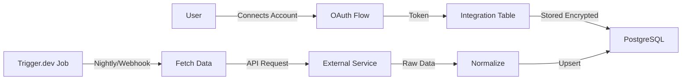
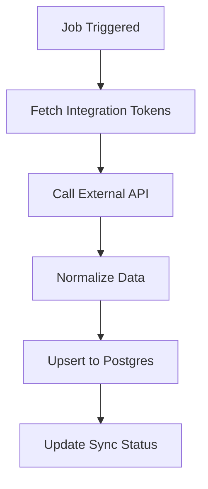
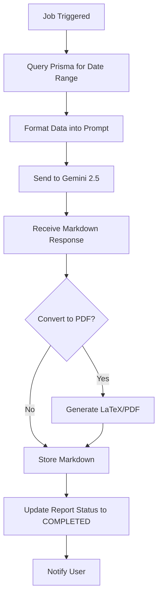
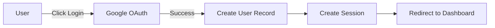
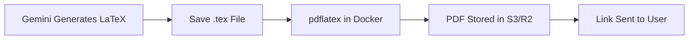

# Coach Watts - System Architecture

## Overview

Coach Watts is an AI-powered cycling coach that analyzes training data from multiple sources (Intervals.icu, Whoop) and provides personalized coaching insights using Google Gemini AI.

## 1. High-Level Stack

| Component           | Technology         | Purpose                                       |
| ------------------- | ------------------ | --------------------------------------------- |
| **Framework**       | Nuxt 3             | Full Stack: SSR + API Routes                  |
| **Database**        | PostgreSQL         | Primary data store (via Supabase or Neon)     |
| **ORM**             | Prisma             | Type-safe database access                     |
| **Data Access**     | Repository Pattern | Centralized data access logic                 |
| **Authentication**  | NuxtAuth           | Based on NextAuth with Google Provider        |
| **Background Jobs** | Trigger.dev (v3)   | Async data ingestion and AI processing        |
| **AI Engine**       | Google Gemini 2.5  | Flash for daily checks, Pro for deep analysis |
| **UI Library**      | Nuxt UI            | Component library for consistent design       |

## 2. Core Functional Modules

### A. Data Access Layer (Repository Pattern)

To ensure data consistency and encapsulate complex logic (like handling duplicates or permissions), we use the Repository Pattern.

**Key Repositories:**

- **WorkoutRepository:** Centralizes access to `Workout` data, automatically handling `isDuplicate` filtering and user ownership checks.

**Usage Standard:**

- **Avoid:** Direct `prisma.model.find...` calls in API handlers for complex models.
- **Prefer:** `repository.getForUser(...)` or similar encapsulated methods.

### B. Data Ingestion Layer (The "Senses")

The system normalizes data from different sources into a unified `Workout` and `DailyMetric` format.

#### Data Sources

**Intervals.icu**

- Excellent for raw power data, FTP, and fitness/fatigue charts (ATL/CTL)
- Provides detailed workout metrics and training calendar

**Whoop**

- Gold standard for Recovery (HRV)
- Sleep tracking and quality metrics
- Strain calculation

#### Data Flow



**Process:**

1. User connects account via OAuth
2. Token stored encrypted in database
3. Trigger.dev job runs nightly or on webhook event
4. Data fetched from external APIs
5. Data normalized and stored in Postgres

### B. The AI Agent Layer (The "Brain")

The AI is split into two specialized agents to manage context window limits and improve accuracy.

#### Agent 1: The Analyst (Retrospective)

**Purpose:** Deep analysis of past performance

| Property     | Value                                      |
| ------------ | ------------------------------------------ |
| **Trigger**  | Weekly or Monthly (User requested)         |
| **Model**    | Gemini 2.5 Pro (High reasoning capability) |
| **Input**    | Last 4 weeks of workouts + daily metrics   |
| **Strategy** | Chain-of-Thought reasoning                 |
| **Output**   | Markdown report (convertible to PDF)       |

**Data Analyzed:**

- Power curve and zone distribution
- Average HRV and sleep scores
- Training Stress Balance (TSB)
- Correlation between high strain and low recovery

**Prompt Strategy:**

```
"Look at the TSB (Training Stress Balance).
Identify trends where high strain correlated with low recovery.
Analyze power progression and fatigue accumulation."
```

**Output Formats:**

- Markdown report for web viewing
- PDF via headless browser (Puppeteer) or LaTeX compilation

#### Agent 2: The Coach (Prescriptive)

**Purpose:** Daily guidance and workout adjustments

| Property    | Value                                                 |
| ----------- | ----------------------------------------------------- |
| **Trigger** | Daily Morning Briefing or Plan Change Request         |
| **Model**   | Gemini 2.5 Flash (Low latency, cost-effective)        |
| **Input**   | Yesterday's load + Today's recovery + Planned workout |
| **Output**  | Structured JSON suggestion + Explanation              |

**Decision Logic:**

```
IF Recovery < 33% AND Planned Workout = "VO2 Max Intervals"
THEN Suggest: "Swap to Zone 2 Endurance or Rest Day."

IF Recovery > 80% AND Recent Training Load < Threshold
THEN Suggest: "Consider adding high-intensity interval session"
```

**Input Data:**

- **Hard Data:** Yesterday's training load, Today's Whoop Recovery, Planned workout from Intervals.icu
- **Soft Data:** User subjective feeling (via UI form)

## 3. Data Flow & Async Jobs (Trigger.dev)

Since fetching 6 months of history and analyzing with Gemini can take 30+ seconds, these operations run as background jobs.

### Job: `ingest-user-history`

**Purpose:** Fetch and store data from external APIs



**Steps:**

1. Fetches data from Intervals/Whoop APIs
2. Normalizes data format
3. Upserts into Postgres (prevents duplicates)
4. Updates sync status in Integration table

### Job: `generate-coach-report`

**Purpose:** Generate AI-powered analysis reports



**Steps:**

1. Queries Prisma for requested date range
2. Formats data into dense text summary (JSON/CSV string)
3. Sends to Gemini 2.5 (Pro or Flash)
4. Receives Markdown response
5. Optional: Converts to PDF/LaTeX
6. Updates database Report status to 'COMPLETED'
7. Pushes notification to client (WebSocket/SSE or Polling)

## 4. Authentication Strategy

### Primary Authentication: Google SSO



**Implementation:**

- Google SSO is the entry point
- User record created on first login
- Session managed via NuxtAuth

### Integration Authentication

Separate table for `IntegrationTokens` because one user might have multiple integrations:

- Whoop
- Intervals.icu
- Future: Strava, Garmin, etc.

**Security Considerations:**

- Access tokens for external APIs encrypted at rest
- OAuth refresh tokens stored securely
- Tokens refreshed automatically before expiration
- Scope limitations properly enforced

## 5. Report Generation

### Markdown Reports

**Purpose:** Web viewing in dashboard

**Technology:**

- `@nuxtjs/mdc` for rendering
- Styled with Tailwind typography classes
- Interactive elements possible (charts, graphs)

**Advantages:**

- Fast rendering
- Interactive
- Easy to style
- Version control friendly

### LaTeX/PDF Reports

**Purpose:** Formal coaching reports for download

**Pipeline:**



**Alternative (Simpler):**

- Gemini generates Markdown
- Generic PDF generator converts to PDF
- Reduces infrastructure complexity

**Storage:**

- PDFs stored in blob storage (S3, Cloudflare R2)
- URLs stored in database
- Signed URLs for secure access

## 6. System Scalability Considerations

### Performance Optimization

1. **Background Jobs:** Heavy lifting (AI, data fetching) offloaded to Trigger.dev
2. **Database Indexing:** Proper indexes on user queries (userId + date)
3. **Caching:** Redis layer for frequently accessed data (optional)
4. **API Rate Limiting:** Respect external API limits

### Cost Optimization

1. **AI Model Selection:**
   - Flash for quick, frequent operations (daily checks)
   - Pro only for deep analysis (weekly/monthly reports)

2. **Data Storage:**
   - Archive old workout data to cold storage after 2 years
   - Compress raw JSON data

3. **Background Jobs:**
   - Batch processing where possible
   - Smart scheduling to avoid peak hours

### Security

1. **Data Protection:**
   - All tokens encrypted at rest
   - HTTPS everywhere
   - Environment variables for secrets

2. **Access Control:**
   - Row-level security in Postgres
   - JWT-based authentication
   - Rate limiting on API endpoints

3. **Privacy:**
   - GDPR compliance considerations
   - User data export capability
   - Right to deletion implementation

## 7. Future Enhancements

### Phase 2 Features

- Strava integration
- Garmin Connect integration
- Real-time workout adjustments
- Community features (coach sharing)

### Phase 3 Features

- Mobile app (React Native)
- Wearable device integration
- Video analysis (form checking)
- Nutrition tracking integration

### AI Improvements

- Fine-tuned models on cycling-specific data
- Multi-modal analysis (power + video)
- Predictive performance modeling
- Injury risk assessment

## 8. Technology Decisions Rationale

### Why Nuxt 3?

- Full-stack framework (API + Frontend)
- Excellent TypeScript support
- SSR for better SEO and initial load
- Large ecosystem

### Why Prisma?

- Type-safe database queries
- Excellent migration management
- Great developer experience
- Good PostgreSQL support

### Why Trigger.dev?

- Purpose-built for background jobs
- Great observability
- Handles retries and failures
- Native TypeScript support

### Why Gemini 2.5?

- Excellent reasoning capabilities
- Cost-effective (especially Flash)
- Large context window
- Good structured output support

### Why PostgreSQL?

- Robust and reliable
- Great JSON support
- Excellent indexing
- Mature ecosystem
