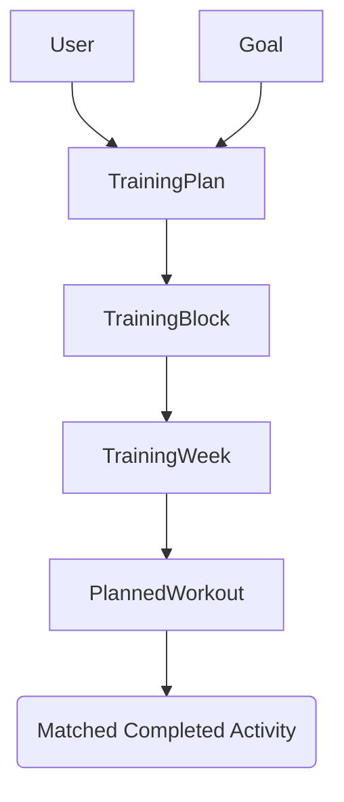

# Goal-Driven Training System

## Overview

The Goal-Driven Training System is a core feature of Coach Wattz that transforms high-level athletic goals (races, events, or fitness milestones) into dynamic, periodized training plans. Unlike static plans, this system uses AI to generate workouts "Just-In-Time," allowing for adaptation based on real-world constraints, illness, or missed sessions.

## 1. Architecture

The system follows a hierarchical periodization model:

1.  **Macrocycle (`TrainingPlan`)**: The overall plan spanning from the start date to the goal/target date.
2.  **Mesocycle (`TrainingBlock`)**: Distinct phases of training (e.g., Base 1, Build, Peak/Taper), typically 3-6 weeks long.
3.  **Microcycle (`TrainingWeek`)**: A single week within a block, defining targets for TSS, volume, and recovery status.
4.  **Session (`PlannedWorkout`)**: Individual workout sessions with structured interval data.

### 1.1 Data Model Hierarchy

## 2. Key Components

### 2.1 The Plan Wizard (`PlanWizard.vue`)

The interactive onboarding flow where users:

- Select or create a **Goal**.
- Profile the **Event** (Distance, Elevation, Terrain).
- Define **Training Availability** (Days of week, slots).
- Choose a **Strategy** (Linear, Polarized, etc.) and **Volume Preference**.
- Preview the **Block Structure** before activation.

### 2.2 Plan Dashboard (`PlanDashboard.vue`)

A specialized view for active plans that provides:

- **Timeline Visualization**: Horizontal view of the Mesocycle progression.
- **Week Overview**: Summary of TSS/Volume targets for the selected week.
- **Workout List**: Status tracking (Planned vs. Completed) and quick access to generation tools.

### 2.3 Workout Matcher (`WorkoutMatcher.vue`)

A utility to manually resolve discrepancies between planned and completed activities:

- Displays unlinked completed workouts side-by-side with pending planned workouts.
- Allows drag-and-drop or click-to-link pairing.
- Updates compliance metrics and plan status.

## 3. AI Generation Logic

The system utilizes Google Gemini (via Trigger.dev background tasks) for two-stage generation:

### 3.1 Block Generation (`generate-training-block`)

- **Input**: Block focus (e.g., Sweet Spot), User availability, Goal profile.
- **Output**: High-level daily workout definitions (e.g., "Tue: 60m Tempo Intervals").
- **Context**: The AI is instructed to follow a specific "rhythm" (e.g., 3 loading weeks followed by 1 recovery week).

### 3.2 Structured Workout Generation (`generate-structured-workout`)

- **Input**: High-level workout title and user FTP.
- **Output**: A granular JSON structure (the "AWP" - Atomic Workout Protocol) containing:
  - Warmup duration/ramp.
  - Main set intervals (% of FTP, repeats, rest periods).
  - Cooldown duration.

## 4. Dynamic Adaptation

The system is designed to handle the "Chaos of Life" via the **Adaptation Wizard**:

- **Push Forward**: Shifting the remaining schedule if a week is missed.
- **Recalculate**: Adjusting the intensity of the remaining block based on recent performance or fatigue.
- **Mark Sick**: Inserting rest periods and adjusting the ramp rate for the return to training.

## 5. External Integrations

- **Intervals.icu**: Planned workouts are synced outbound to the user's calendar. Completed activities are synced inbound and auto-matched to plan sessions where possible.
- **Whoop/Wellness**: Recovery scores and HRV are used as context for the adaptation logic to suggest easier days or rest.

## 6. Implementation Status

- **Models**: ✅ Complete
- **Wizard**: ✅ Complete
- **Dashboard**: ✅ Complete
- **Matcher**: ✅ Complete
- **AI Logic**: ✅ Basic Generation Implemented
- **Adaptation**: 🚧 Skeleton Implemented (AI Prompts Pending)
