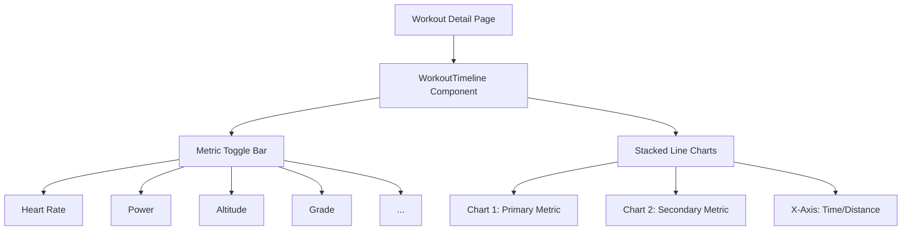

# Plan: Enhance Workout Timeline Metrics

This plan outlines the enhancements for the `WorkoutTimeline.vue` component to support a broader range of metrics and improved visualization.

## 1. Metric Definitions

The following metrics will be supported in the timeline, categorized by their source and utility.

| Metric          | Key          | Unit    | Description                                 |
| --------------- | ------------ | ------- | ------------------------------------------- |
| **Heart Rate**  | `heartrate`  | bpm     | Cardiovascular intensity                    |
| **Altitude**    | `altitude`   | m       | Elevation profile                           |
| **Speed/Pace**  | `velocity`   | m/s     | Movement speed (converted to pace for runs) |
| **Power**       | `watts`      | W       | Mechanical work output                      |
| **Cadence**     | `cadence`    | rpm/spm | Leg or arm speed                            |
| **Grade**       | `grade`      | %       | Surface incline                             |
| **Temperature** | `temp`       | °C      | Environmental conditions                    |
| **L/R Balance** | `lr_balance` | %       | Pedal stroke symmetry (cycling)             |

## 2. Technical Enhancements

### Frontend (`WorkoutTimeline.vue`)

- **Metric Expansion**: Update `availableMetrics` computed property to include Grade, Temperature, and L/R Balance.
- **Improved Tooltips**: Enhance tooltips to show multiple active metrics at the same timestamp.
- **Smoothing Options**: Add a "Smoothing" toggle (e.g., 5s, 30s moving average) to reduce noise in high-frequency data like Power and Speed.
- **Unit Conversion**: Ensure `velocity` (m/s) is correctly displayed as Pace (min/km or min/mile) for running/walking activities.
- **Visual Distinction**: Refine color palette for better contrast when multiple metrics are overlaid or stacked.

### Backend (`server/api/workouts/[id]/streams.get.ts`)

- **Schema Alignment**: Ensure the API returns all available fields from the `WorkoutStream` model (Grade, Moving, etc.).
- **Fallback Logic**: Maintain the existing Strava splits fallback but prioritize the full `WorkoutStream` when available.

## 3. Implementation Steps

### Step 1: Backend Data Exposure

- Update `server/api/workouts/[id]/streams.get.ts` to explicitly include all relevant `WorkoutStream` fields.

### Step 2: Frontend Metric Definition

- Update `availableMetrics` in `WorkoutTimeline.vue` with new keys, labels, colors, and units.
- Implement specialized formatting for Pace vs Speed based on activity type.

### Step 3: Visualization Refinement

- Implement a synchronized crosshair across stacked charts.
- Add a data smoothing utility for "jumpy" streams.

## 4. Proposed Timeline UI Structure

## 5. User Feedback Request

Does this plan cover all the metrics you were envisioning? Would you prefer a single chart with multiple axes or the current stacked chart approach for better clarity?
