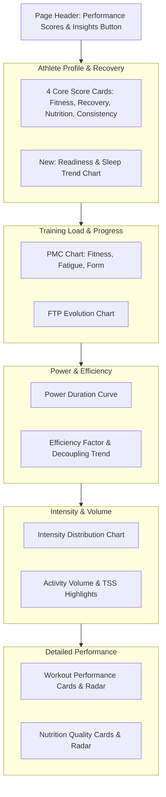

# Performance Page Upgrade Plan

## Proposed New Widgets and Metrics

### 1. Activity Highlights (The "Big Numbers")

Instead of just score cards, show high-level activity stats for the selected period.

- **Total Duration & Distance**: Aggregated across all sports.
- **TSS Accumulation**: Total training stress for the period.
- **Workload Ratio**: Current 7-day load vs 42-day average (to detect overtraining).

### 2. Power Duration Curve (Power Curve)

A classic cycling metric to show peak power across different time durations.

- **Component**: `PowerCurveChart.vue` (Already exists? Need to verify/enhance).
- **Functionality**: Show current period peaks vs all-time or vs previous period.

### 3. Aerobic Efficiency Trend

Track `Efficiency Factor (EF)` and `Aerobic Decoupling (Pa:Hr)` over time.

- **Metric**: EF = Normalized Power / Average HR.
- **Trend**: Is the athlete getting more "bang for their buck" (more power for less HR)?

### 4. Sleep & Readiness Correlation

Link recovery data (Whoop/Withings) with workout performance.

- **Chart**: Overlay `Recovery Score` or `HRV` with `Workout Overall Score`.
- **Insight**: Does better sleep actually lead to better workout execution for this specific athlete?

### 5. Intensity Distribution (Enhanced)

Current `WeeklyZoneChart` is good, but we can add a "Time in Zone" summary widget.

- **Widget**: `WeeklyZoneSummary` (Already exists? Verify).
- **Metric**: 80/20 distribution check (Are 80% of workouts in Zone 1-2?).

---

## Layout Redesign

---

## Technical Tasks

1.  **API Enhancements**:
    - Update `server/api/scores/athlete-profile.get.ts` to include recovery/readiness trends.
    - Create/Update `server/api/workouts/power-curve.get.ts` for power duration data.
    - Create `server/api/scores/efficiency-trends.get.ts` for EF/Decoupling tracking.

2.  **Frontend Components**:
    - Build `ActivityHighlights.vue` card.
    - Build `EfficiencyTrendChart.vue`.
    - Integrate `PowerCurveChart.vue` into the performance page.
    - Add "Readiness vs Performance" correlation chart.

3.  **Page Integration**:
    - Refactor `app/pages/performance.vue` into sections for better readability.
    - Add period selectors for the new charts.
